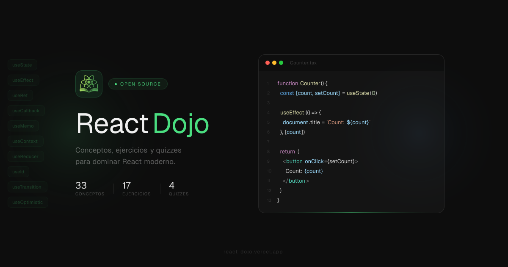

<p align="center">
  
</p>

# React Dojo

Learn React by doing.

Each concept includes a clear explanation, an interactive playground, and real-world coding exercises — no shortcuts, just practice.

https://react-dojo.vercel.app

---

## Features

- Clear, focused explanations of core React concepts  
- Interactive playgrounds powered by Sandpack  
- Hands-on exercises with real code  
- Fast, minimal experience  

---

## Tech Stack

- React 19 + TypeScript  
- Vite  
- Tailwind CSS v4  
- Sandpack  

---

## Getting Started

```bash
npm install
npm run dev